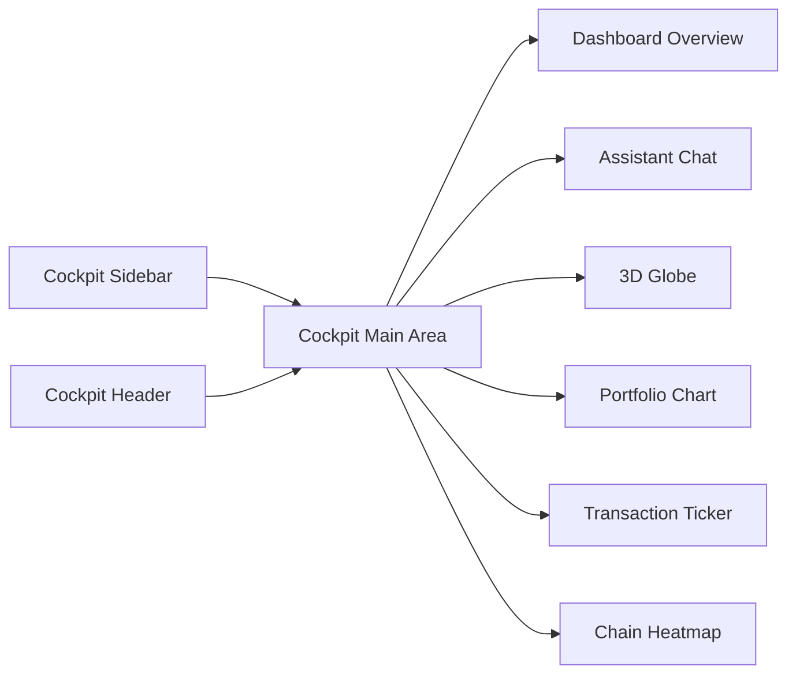
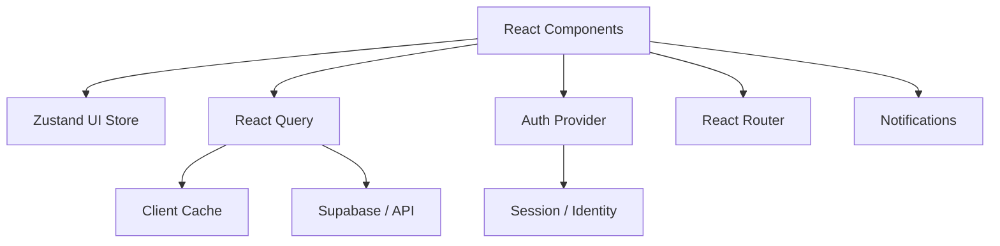
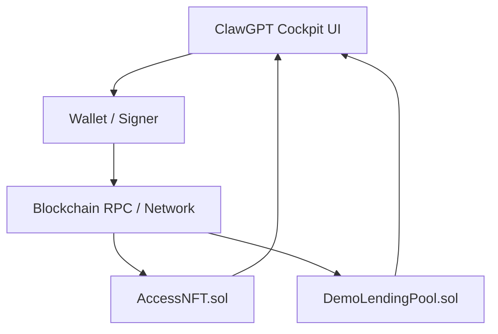
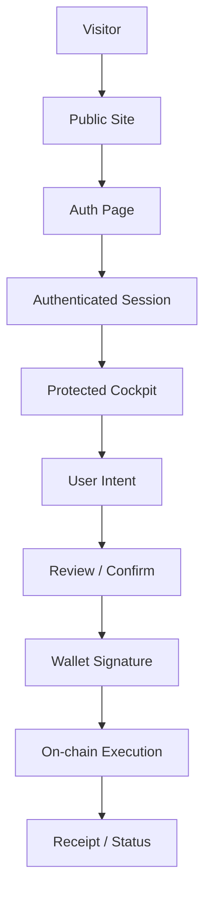
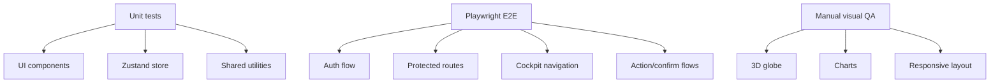
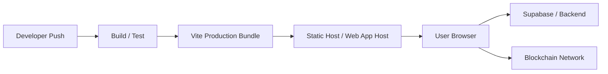
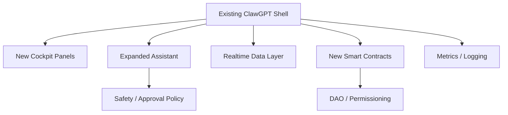
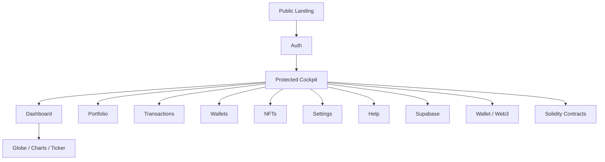

# ClawGPT: Your AI Financial Navigator

[](https://react.dev/)
[](https://www.typescriptlang.org/)
[](https://vitejs.dev/)
[](https://tailwindcss.com/)
[](https://threejs.org/)
[](https://supabase.com/)
[](LICENSE)

ClawGPT is an AI-powered financial cockpit for navigating multi-chain assets through a conversational interface. The repository combines a polished landing page, a protected authenticated cockpit, a 3D globe-based visual layer, live-style transaction telemetry, and a smart-contract folder for on-chain experimentation. The project is built with React, TypeScript, Vite, Tailwind CSS, shadcn/ui, React Three Fiber, Supabase, and a modern routing/data stack.

---

## Table of contents

1. [Vision](#vision)
2. [What ClawGPT is designed to do](#what-clawgpt-is-designed-to-do)
3. [Live product surface](#live-product-surface)
4. [System architecture](#system-architecture)
5. [Request and data flow](#request-and-data-flow)
6. [Routing map](#routing-map)
7. [Repository structure](#repository-structure)
8. [Tech stack](#tech-stack)
9. [Core UI building blocks](#core-ui-building-blocks)
10. [State management and client services](#state-management-and-client-services)
11. [Blockchain and smart contract layer](#blockchain-and-smart-contract-layer)
12. [Security model](#security-model)
13. [Development setup](#development-setup)
14. [Environment configuration](#environment-configuration)
15. [Scripts](#scripts)
16. [Testing strategy](#testing-strategy)
17. [Deployment notes](#deployment-notes)
18. [Extending ClawGPT](#extending-clawgpt)
19. [Roadmap ideas](#roadmap-ideas)
20. [Troubleshooting](#troubleshooting)
21. [Contributing](#contributing)
22. [License](#license)

---

## Vision

ClawGPT is shaped around a simple idea: managing on-chain assets should feel like talking to a capable financial operator, not manually wiring together dashboards, explorers, bridges, and wallet tools.

Instead of splitting the experience across many tabs, ClawGPT proposes a single cockpit:

- a conversational layer for asking financial questions or issuing actions,
- a visual layer for understanding assets across chains,
- a protected app shell for authenticated workflows,
- and a contract layer for experimenting with access control, governance, and lending primitives.

The design favors a “command center” metaphor. The public site introduces the product. The authenticated app becomes the operating environment. The cockpit then combines discovery, action, and visibility into one workflow.

---

## What ClawGPT is designed to do

The repository and its README description point to a product that focuses on:

- conversational portfolio navigation,
- multi-chain asset management,
- self-custodial operations,
- visual intelligence through a 3D globe,
- transaction awareness through live ticker-like UI,
- and autonomous agent-style assistance for finance-related workflows.

In practical terms, the user journey is meant to look like this:

1. land on the marketing site,
2. understand the product value,
3. sign in,
4. enter the cockpit,
5. inspect balances and activity,
6. ask the assistant to help with a task,
7. review the action,
8. and confirm or continue into another workflow.

The codebase is structured to support that sequence with route separation, reusable cockpit components, and a clear split between public and protected areas.

---

## Live product surface

The repository’s public-facing surface is organized into a landing experience and an authenticated cockpit.

### Public surface
The landing experience includes sections such as:

- a hero section,
- feature and “how it works” sections,
- a demo section,
- a call-to-action section,
- navigation,
- and a footer.

This gives the project a conventional product-marketing entry point while still feeling visually aligned with the cockpit.

### Authenticated cockpit
The application shell under `/app` includes dedicated pages for:

- dashboard,
- portfolio,
- transactions,
- wallets,
- NFTs,
- settings,
- help.

That route set is important because it shows that the project is not only a landing page. It is already organized as an application with multiple internal workspaces.

---

## System architecture

The following diagram shows the project at a high level based on the repository structure and app routing.

```mermaid
flowchart TB
    User[User] --> Browser[Browser]
    Browser --> Landing[Public Landing Experience]
    Browser --> Auth[Auth Page]
    Browser --> AppShell[Protected /app Shell]

    Landing --> CTA[Launch / Watch Demo / Join Waitlist]
    Auth --> Session[Authenticated Session]

    Session --> AppShell
    AppShell --> Dashboard[Dashboard]
    AppShell --> Portfolio[Portfolio]
    AppShell --> Transactions[Transactions]
    AppShell --> Wallets[Wallets]
    AppShell --> NFTs[NFTs]
    AppShell --> Settings[Settings]
    AppShell --> Help[Help]

    Dashboard --> Globe[3D Globe / Visualization Layer]
    Dashboard --> Ticker[Transaction Ticker]
    Dashboard --> Chat[Conversational Assistant]
    Portfolio --> Charts[Portfolio Analytics]
    Wallets --> ChainState[Wallet & Chain State]
    NFTs --> Contracts[Smart Contract Features]

    AppShell --> Supabase[Supabase Services]
    AppShell --> WalletKit[Wallet / Web3 Integration]
    AppShell --> ContractsLayer[Solidity Contracts]
    AppShell --> Query[React Query Cache]
    AppShell --> Store[Client UI Store]
````

### What the diagram means

* **React routes** divide the public and protected experiences.
* **Client state** coordinates the cockpit shell, sidebar, and layout behavior.
* **Supabase** is present as a backend integration point.
* **Three.js / React Three Fiber** powers the visual globe layer.
* **Contracts** sit in their own folder so on-chain experimentation stays isolated from the UI code.
* **React Query** provides the right place for async fetching and caching.

---

## Request and data flow

A typical user action inside the cockpit might move through the system like this:

```mermaid
sequenceDiagram
    participant U as User
    participant UI as Cockpit UI
    participant S as Store / UI State
    participant Q as React Query
    participant B as Backend / Supabase
    participant W as Wallet / Web3 Layer
    participant C as Smart Contract

    U->>UI: Ask a question or select an action
    UI->>S: Update local interaction state
    UI->>Q: Request fresh data if needed
    Q->>B: Fetch portfolio / profile / app data
    B-->>Q: Return data
    Q-->>UI: Cached or fresh response
    UI->>W: Prepare wallet transaction or signing flow
    W->>C: Execute on-chain call
    C-->>W: Transaction result
    W-->>UI: Confirmation / error
    UI-->>U: Render updated state and feedback
```

### Why this flow matters

The architecture keeps the app responsive:

* local UI state handles shell behavior quickly,
* query caching handles server data,
* wallet operations remain explicit and user-driven,
* and contract interactions are isolated from presentation.

That makes the product easier to reason about and safer to extend.

---

## Routing map

The application routes are defined in `src/App.tsx`. At a glance, the navigation tree looks like this:

```mermaid
graph TD
    Root[/] --> Landing[Index]
    Root --> Auth[/auth]
    Root --> Protected[/app]

    Protected --> Dashboard[/app]
    Protected --> Portfolio[/app/portfolio]
    Protected --> Transactions[/app/transactions]
    Protected --> Wallets[/app/wallets]
    Protected --> NFTs[/app/nfts]
    Protected --> Settings[/app/settings]
    Protected --> Help[/app/help]

    Root --> NotFound[Fallback 404]
```

### Route behavior

* `/` renders the marketing homepage.
* `/auth` handles authentication entry.
* `/app` is wrapped in a protected route.
* the cockpit uses a shared layout with a sidebar and header.
* nested routes render each section of the authenticated experience.

This separation is one of the strongest design choices in the repository because it prevents the public homepage and the authenticated app from becoming entangled.

---

## Repository structure

The repository is organized around a modern Vite + React app with supporting backend and contract folders.

```text
clawgpt-your-ai-financial-navigator/
├── contracts/
│   ├── AccessNFT.sol
│   └── DemoLendingPool.sol
├── public/
├── src/
│   ├── components/
│   │   ├── cockpit/
│   │   │   ├── ChainHeatmap.tsx
│   │   │   ├── CockpitChat.tsx
│   │   │   ├── CockpitDashboard.tsx
│   │   │   ├── CockpitGlobe.tsx
│   │   │   ├── CockpitHeader.tsx
│   │   │   ├── CockpitSidebar.tsx
│   │   │   ├── PortfolioChart.tsx
│   │   │   └── Ticker.tsx
│   │   ├── ui/
│   │   ├── CTASection.tsx
│   │   ├── DemoSection.tsx
│   │   ├── ErrorBoundary.tsx
│   │   ├── FeaturesSection.tsx
│   │   ├── Footer.tsx
│   │   ├── GlobeScene.tsx
│   │   ├── HeroSection.tsx
│   │   ├── HowItWorksSection.tsx
│   │   ├── NavLink.tsx
│   │   ├── Navbar.tsx
│   │   └── ProtectedRoute.tsx
│   ├── config/
│   ├── hooks/
│   ├── integrations/
│   │   └── supabase/
│   ├── layouts/
│   ├── lib/
│   ├── pages/
│   │   ├── cockpit/
│   │   │   ├── DashboardPage.tsx
│   │   │   ├── HelpPage.tsx
│   │   │   ├── NFTsPage.tsx
│   │   │   ├── PortfolioPage.tsx
│   │   │   ├── SettingsPage.tsx
│   │   │   ├── TransactionsPage.tsx
│   │   │   └── WalletsPage.tsx
│   │   ├── AuthPage.tsx
│   │   ├── Index.tsx
│   │   └── NotFound.tsx
│   ├── services/
│   ├── store/
│   ├── test/
│   ├── types/
│   ├── App.css
│   ├── App.tsx
│   ├── index.css
│   ├── main.tsx
│   └── vite-env.d.ts
├── .env
├── components.json
├── eslint.config.js
├── index.html
├── package.json
├── playwright.config.ts
├── postcss.config.js
├── tailwind.config.ts
├── tsconfig.json
├── tsconfig.app.json
├── tsconfig.node.json
├── vite.config.ts
└── vitest.config.ts
```

### What stands out

* `src/components/cockpit` is where the authenticated workspace is composed.
* `src/components/ui` provides the low-level design system primitives.
* `src/pages/cockpit` keeps each internal page separately maintainable.
* `contracts` is separated cleanly from client code.
* `integrations/supabase` indicates a backend connection point without forcing the whole app into a monolithic server architecture.

---

## Tech stack

The repository’s declared stack and dependencies show a fairly rich frontend platform.

### Core

* React 18
* TypeScript 5
* Vite 5

### UI and styling

* Tailwind CSS 3
* shadcn/ui
* Radix UI primitives
* Lucide icons
* Framer Motion
* Sonner for notifications

### Visualization

* Three.js
* React Three Fiber
* @react-three/drei
* Recharts

### Data and state

* TanStack React Query
* Zustand
* React Hook Form
* Zod
* date-fns

### Backend / platform

* Supabase JS client

### Testing

* Vitest
* Playwright
* Testing Library
* JSDOM

This is a strong combination for a product that needs polished UI, async data, charting, and some amount of interactive 3D visualization.

---

## Core UI building blocks

The user interface is split into a public marketing layer and a protected cockpit layer.

### Public marketing layer

The public pages are organized around conversion and explanation:

* **Navbar** provides navigation and CTAs.
* **HeroSection** introduces the product positioning.
* **FeaturesSection** explains product value.
* **HowItWorksSection** walks through the workflow.
* **DemoSection** supports product understanding.
* **CTASection** pushes the user toward onboarding.
* **Footer** closes the public experience.

The public experience is valuable because a financial cockpit needs trust, clarity, and a strong explanation of the product before asking a user to sign in.

### Protected cockpit layer

The cockpit layer is more operational and dashboard-oriented:

* **CockpitSidebar** handles app navigation.
* **CockpitHeader** anchors the workspace and likely exposes context actions.
* **CockpitDashboard** is the overview surface.
* **CockpitChat** is the conversational control surface.
* **CockpitGlobe** and **GlobeScene** provide the visual world map / asset visualization layer.
* **PortfolioChart** visualizes holdings and trends.
* **Ticker** surfaces fast-moving transactional context.
* **ChainHeatmap** appears suited to chain-level activity or exposure visualization.

### A visual map of the cockpit layout



---

## State management and client services

The app root shows a clear composition strategy.

### Providers in the root app

`src/App.tsx` wraps the application in:

* `QueryClientProvider`
* `AuthProvider`
* `TooltipProvider`
* `Toaster`
* `Sonner`
* `BrowserRouter`

This layering is practical:

* **React Query** handles remote/server state and caching.
* **AuthProvider** centralizes user session logic.
* **TooltipProvider** standardizes accessible UI interaction.
* **Toaster / Sonner** provide feedback channels.
* **Router** keeps public and protected navigation explicit.

### Why this matters

A complex financial UI usually suffers when state is scattered across many components. This project avoids that by:

* centralizing data-fetching through query tooling,
* using a store for shell behavior,
* and letting components stay focused on rendering.

### Likely responsibilities by layer



---

## Blockchain and smart contract layer

The repository includes a `contracts` folder with at least:

* `AccessNFT.sol`
* `DemoLendingPool.sol`

That suggests the project is not just visualizing finance but also exploring on-chain primitives.

### How to think about the contract layer

The contract directory is best treated as an experimental and extensible layer:

* **AccessNFT.sol** likely supports gated access or membership-style permissions.
* **DemoLendingPool.sol** likely demonstrates a lending or liquidity mechanic.
* The contracts provide a foundation for future DeFi and governance interactions.

### Contract integration diagram



### Intended product value of the contract layer

The contracts help the project feel like a real financial platform rather than a mock dashboard. They also create a clean place to later add:

* NFT-based access control,
* vault or pool mechanics,
* governance,
* staking,
* and permissioned financial workflows.

---

## Security model

A financial app needs a security story, even in early-stage form.

### Architecture-level security boundaries

1. **Public vs protected routes**

   * Public pages are accessible without a session.
   * The cockpit is guarded behind a protected route wrapper.

2. **Wallet operations remain explicit**

   * Transaction execution should be a deliberate step.
   * The UI should never silently authorize on-chain actions.

3. **Backend and frontend state stay separated**

   * Query cache handles server responses.
   * Local state handles shell behavior.
   * Wallet state handles signing context.

4. **Contracts are isolated**

   * Smart contracts live outside the client app tree.
   * This keeps chain logic distinct from presentation logic.

### Security flow diagram



### Security considerations to keep in mind

* Validate all addresses and chain IDs before sending transactions.
* Require user confirmation for every asset-moving step.
* Keep private keys out of the browser whenever possible.
* Treat contract interactions as potentially irreversible.
* Sanitize and constrain AI-generated actions before execution.
* Keep Supabase row-level security and auth policies aligned with the cockpit’s access model.

---

## Development setup

The repository uses a Vite-based workflow, so local startup should be straightforward.

### Prerequisites

* Node.js 18+ recommended
* npm, pnpm, or bun
* Git

### Installation

```bash
git clone https://github.com/lucylow/clawgpt-your-ai-financial-navigator.git
cd clawgpt-your-ai-financial-navigator
npm install
```

If you prefer Bun, the repository also includes Bun lockfiles, so Bun is a natural fit:

```bash
bun install
```

### Start the dev server

```bash
npm run dev
```

or

```bash
bun run dev
```

The default Vite app should then be available on the local development port.

### Build for production

```bash
npm run build
```

### Preview the production build

```bash
npm run preview
```

---

## Environment configuration

The repository includes a `.env` file in the root, which indicates environment-driven configuration.

A production-ready setup would typically keep secrets and service keys out of source control and populate them locally or through your deployment provider.

### Typical categories of values to expect

* Supabase project URL
* Supabase anon key
* blockchain network / RPC endpoints
* wallet or SDK config
* feature flags
* analytics or telemetry keys
* authentication callbacks
* any demo-mode defaults

### Example `.env` shape

```bash
VITE_SUPABASE_URL=your_supabase_url
VITE_SUPABASE_ANON_KEY=your_supabase_anon_key
VITE_APP_ENV=development
VITE_DEFAULT_CHAIN=arbitrum
VITE_DEFAULT_CURRENCY=USDt
```

Adjust the actual names to match the code before shipping. The README intentionally keeps this generic because the repository’s current `.env` contents are not exposed in the public view.

---

## Scripts

The `package.json` scripts are:

```json
{
  "dev": "vite",
  "build": "vite build",
  "build:dev": "vite build --mode development",
  "lint": "eslint .",
  "preview": "vite preview",
  "test": "vitest run",
  "test:watch": "vitest"
}
```

### Recommended usage

* `npm run dev` for active development
* `npm run build` before merging or deploying
* `npm run lint` before creating a pull request
* `npm run test` for CI
* `npm run preview` to sanity-check production output locally

---

## Testing strategy

The repository includes both unit and end-to-end tooling.

### Existing test layers

* **Vitest** for unit/integration tests
* **Testing Library** for component behavior
* **Playwright** for browser-level checks
* **JSDOM** for DOM simulation

### What to test first

For a project like this, the highest-value tests are usually:

1. route protection,
2. dashboard rendering,
3. sidebar navigation,
4. chart and ticker rendering,
5. wallet transaction confirmation flows,
6. contract integration helpers,
7. and auth state transitions.

### Example test matrix



### Suggested coverage goals

* public landing page render
* cockpit route redirect when unauthenticated
* cockpit route access when authenticated
* sidebar collapse/expand behavior
* chart data state
* toast/error feedback
* contract action request path

---

## Deployment notes

The app is built with Vite, which makes it suitable for static hosting or frontend deployment platforms.

### Common deployment pattern

1. Build the frontend.
2. Publish the output directory.
3. Configure environment variables on the host.
4. Ensure auth callbacks and backend URLs match the deployed domain.
5. Verify the protected routes and app shell in production.

### Deployment checklist

* confirm `vite build` succeeds,
* verify all public assets resolve correctly,
* ensure the Supabase project is reachable,
* test on-chain calls against the intended network,
* and confirm the wallet provider works in the deployment browser environment.

### Deployment architecture



---

## Extending ClawGPT

This repository is already organized in a way that supports growth. The following areas are natural extension points.

### 1. More cockpit panels

Add panels for:

* yield opportunities,
* chain-by-chain exposure,
* risk scoring,
* position performance,
* debt or liability tracking,
* and watchlists.

### 2. Stronger assistant workflows

Expand the conversational assistant so it can:

* summarize portfolio movements,
* suggest rebalancing,
* draft transaction plans,
* explain gas costs,
* and compare chain routes.

### 3. Better on-chain lifecycle management

Enhance the contract layer with:

* access control,
* governance voting,
* pool lifecycle events,
* and more complete demo contracts.

### 4. Backend event streaming

Use Supabase or another backend to stream:

* transaction events,
* portfolio snapshots,
* notification triggers,
* and user-specific activity feeds.

### 5. Analytics and observability

Add:

* error tracking,
* interaction analytics,
* chain execution logs,
* and UI performance monitoring.

### 6. Agent safety layers

Because this is a financial assistant, any future agentic execution should include:

* approval gates,
* action previews,
* address validation,
* policy checks,
* and transaction simulation.

### Extension architecture



---

## Roadmap ideas

The current codebase already points toward a strong product direction. Future improvements could include:

* real wallet connection flows,
* transaction simulation before signing,
* chain switching UX,
* richer portfolio attribution,
* real-time notifications,
* historical performance charts,
* activity search,
* exportable reports,
* better mobile layout for the cockpit,
* and tighter error recovery around failed web3 operations.

For a hackathon demo, the highest-impact additions are usually the ones that make the product feel trustworthy, interactive, and visibly “alive” in under a minute.

---

## Troubleshooting

### The app does not start

Check that:

* dependencies are installed,
* Node or Bun is available,
* and the local environment variables are present.

### Auth redirects do not work

Check:

* the auth provider settings,
* callback URLs,
* browser console errors,
* and Supabase environment variables.

### Contract actions fail

Check:

* the connected network,
* the wallet address,
* contract deployment addresses,
* gas settings,
* and whether the target contract is actually deployed on that chain.

### The 3D globe is blank or slow

Check:

* browser WebGL support,
* GPU acceleration,
* whether the device can handle the scene,
* and whether fallback rendering is active.

### Charts or dashboards show no data

Check:

* the backend data source,
* whether the query is authenticated,
* whether the response shape matches the component’s expected schema,
* and whether React Query is returning cached empty state.

---

## Contributing

Contributions are easiest when they follow the app’s existing structure.

### Suggested contribution workflow

1. Create a feature branch.
2. Make focused changes in the relevant layer.
3. Add or update tests.
4. Run linting and build checks.
5. Open a pull request with a clear summary.

### Good contribution patterns for this repo

* keep public marketing updates separate from cockpit updates,
* keep on-chain code isolated inside `contracts`,
* keep shared UI primitives inside `src/components/ui`,
* and keep route changes reflected in `src/App.tsx`.

### Code quality guidelines

* Prefer small, composable components.
* Keep wallet actions explicit.
* Use typed data models.
* Avoid spreading chain logic across many UI files.
* Validate assumptions in forms and transaction handlers.
* Document any new environment variables in the README.

---

## License

The repository is marked as MIT licensed in the GitHub badges shown on the project page. Check the repository’s actual license file before redistribution or commercial reuse.

---

## Appendix: recommended README summary block

If you want a shorter version at the top of the GitHub page, you can reuse this summary:

> ClawGPT is an AI-powered financial cockpit for navigating multi-chain assets through a conversational interface. It combines a public product site, an authenticated application shell, a 3D globe visualization layer, portfolio and transaction views, Supabase-backed services, and a Solidity contract workspace for experimenting with on-chain finance workflows.

---

## Appendix: one-page architecture cheat sheet


