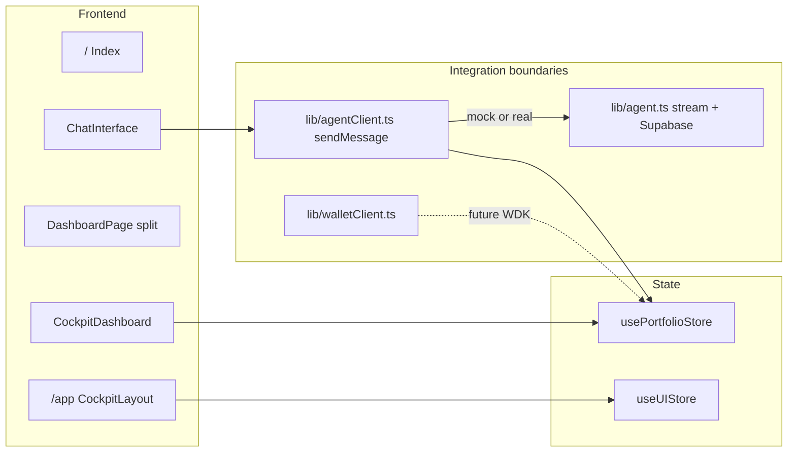

# Architecture — ClawGPT Financial Cockpit

High-level view of how the frontend, state, agent boundary, and wallet boundary fit together.

## Diagram

## Responsibilities

| Layer | Role |
|-------|------|
| **Pages** | Route-level composition (`DashboardPage` = chat + dashboard). |
| **components/chat** | Messages, input, chips; no direct Supabase calls. |
| **lib/agentClient.ts** | Single API for the chat: `sendMessage(text)` → text + optional structured cards + `portfolioUpdate`. |
| **lib/agent.ts** | Streaming HTTP to Supabase `agent-chat`, chat persistence helpers. |
| **lib/walletClient.ts** | Future Tether WDK / chain operations; stubs today. |
| **usePortfolioStore** | `totalValue`, allocation, transactions, wallets, `agent` metadata; dashboard and ticker read from here. |

## Data flow (demo)

1. User sends a message → `sendMessage` resolves (mock or stream).
2. Result may include `portfolioUpdate` → store reducers adjust allocation / push transactions.
3. `CockpitDashboard`, `Ticker`, charts re-render from the same store.

## Environment flags

| Variable | Purpose |
|----------|---------|
| `VITE_USE_MOCK_AGENT` | `true` forces rich mock agent (default in dev if unset). |
| `VITE_SUPABASE_URL` / `VITE_SUPABASE_PUBLISHABLE_KEY` | Real agent + auth when mock is off. |

See `README.md` for full env list.
